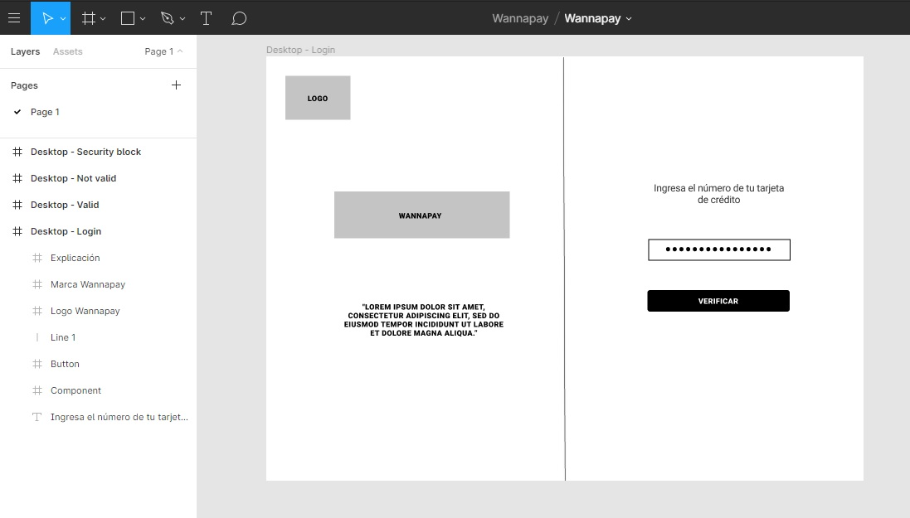
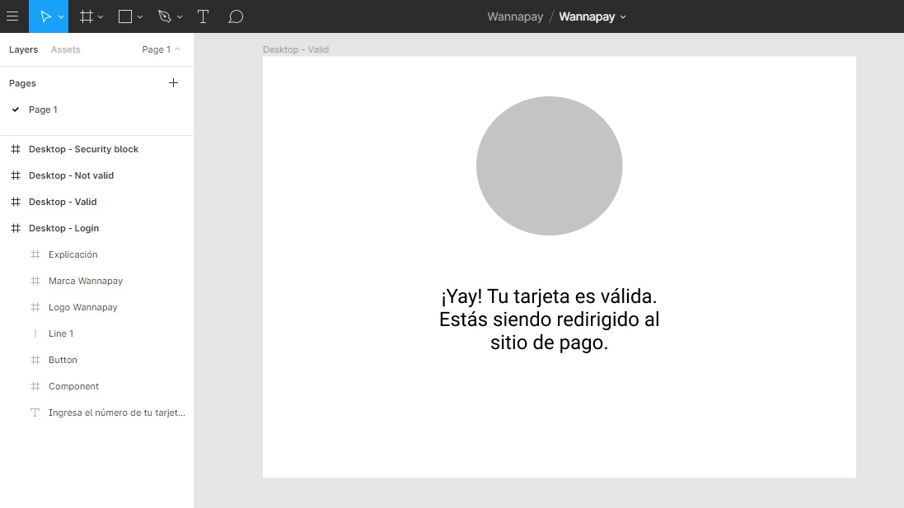

# Tarjeta de crédito válida: Wannapay 

Wannapay es una aplicación web segura que le permite a un usuario validar el número de su tarjeta de crédito a través de un algoritmo especial para ello (algoritmo de Luhn) sin tener que consultar directamente con la tienda en línea en la que quiere realizar su compra. 

## Imágenes finales:

1. Homepage:

2. Página para tarjeta de crédito no valida:

## Investigación UX

Los usuarios de este producto serían compradores en línea que van a ingresar su tarjeta y quieren que su información esté segura y saber de manera rápida y sencilla si su tarjeta de crédito les sirve para comprar en su tienda en línea de preferencia. En un rango edad entre 18 - 85?? :older_woman:

Adicionalmente -personas que definitivamente prefieren realizar sus compras en línea versus ir a una tienda. 

El producto resuelve el problema de los usuarios ya que en un simple input y un click, el usuario obtiene la información que necesita y de manera rápida, ya que se enmascaran los dígitos de su tarjeta (menos los últimos cuatro), y le da la opción de seguir con su proceso de pago si su tarjeta fue válida, o de volver a intentarlo si por algún motivo no ha sido reconocida como válida.

Primer prototipo en papel: 

Al consultar con varias compañeras de mesa, les pareció que el sistema era algo complicado -que te llevaba de una pantalla a otra sin darte la información que querías obtener de manera rápida. Por eso se modificó para que el input del usuario se recibiera en la misma página de inicio, y el siguiente paso validaría o no su tarjeta, dándole opciones al usuario de cómo seguir su proceso dependiendo del caso.
También me dijeron por ahí que se parece a una web app de un conocido banco del Perú y que Wannapay suena quechua. Talk about inclusive UX. :speak_no_evil:

Imagen del prototipo final:

1. Homepage:

2. Página de validación:

## Objetivos de aprendizaje (~~cumplidos~~):

### UX

* [ ] [Diseñar la aplicación pensando y entendiendo al usuario]
* [ ] ~~[Crear prototipos para obtener feedback e iterar]~~
* [ ] ~~[Aplicar los principios de diseño visual]~~

### HTML y CSS

* [ ] ~~[Uso correcto de HTML semántico]~~
* [ ] ~~[Uso de selectores de CSS]~~
* [ ] ~~[Construir tu aplicación respetando el diseño realizado]~~

### DOM

* [ ] [Uso de selectores de nodos del DOM](https://lms.laboratoria.la/cohorts/lim-2020-01-bc-core-lim012/courses/browser/02-dom/03-1-dom-methods-selection)
* [ ] [Manejo de eventos del DOM](https://lms.laboratoria.la/cohorts/lim-2020-01-bc-core-lim012/courses/browser/02-dom/04-events)
* [ ] [Manipulación dinámica del DOM](https://developer.mozilla.org/es/docs/Referencia_DOM_de_Gecko/Introducci%C3%B3n)

### Javascript

* [ ] [Manipulación de strings](https://lms.laboratoria.la/cohorts/lim-2020-01-bc-core-lim012/courses/javascript/06-strings/01-strings)
* [ ] [Uso de condicionales](https://lms.laboratoria.la/cohorts/lim-2020-01-bc-core-lim012/courses/javascript/02-flow-control/01-conditionals-and-loops)
* [ ] [Uso de bucles](https://lms.laboratoria.la/cohorts/lim-2020-01-bc-core-lim012/courses/javascript/02-flow-control/02-loops)
* [ ] [Uso de funciones](https://lms.laboratoria.la/cohorts/lim-2019-09-bc-core-lim011/courses/javascript/02-flow-control/03-functions)
* [ ] [Datos atómicos y estructurados](https://www.todojs.com/tipos-datos-javascript-es6/)
* [ ] Utilizar ES Modules (`import` | `export`).

### Testing

* [ ] [Testeo de tus funciones](https://jestjs.io/docs/es-ES/getting-started)

### Git y GitHub

* [ ] [Comandos de git](https://lms.laboratoria.la/cohorts/lim-2019-09-bc-core-lim011/courses/scm/01-git/04-commands)
  (`add` | `commit` | `pull` | `status` | `push`).
* [ ] [Manejo de repositorios de GitHub](https://lms.laboratoria.la/cohorts/lim-2019-09-bc-core-lim011/courses/scm/02-github/01-github)  (`clone` | `fork` | `gh-pages`).

### Buenas prácticas de desarrollo

* [ ] Organizar y dividir el código en módulos (Modularización).
* [ ] Uso de identificadores descriptivos (Nomenclatura | Semántica).
* [ ] Uso de linter para seguir buenas prácticas (ESLINT).

Y cómo me siento al terminar este proyecto:

