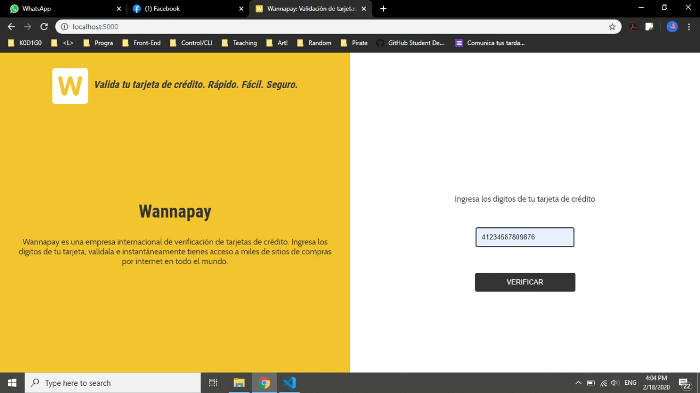
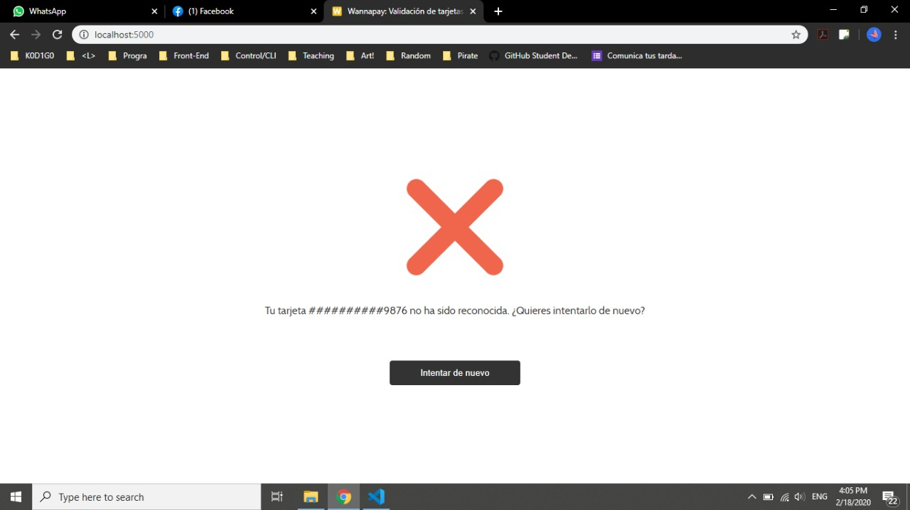
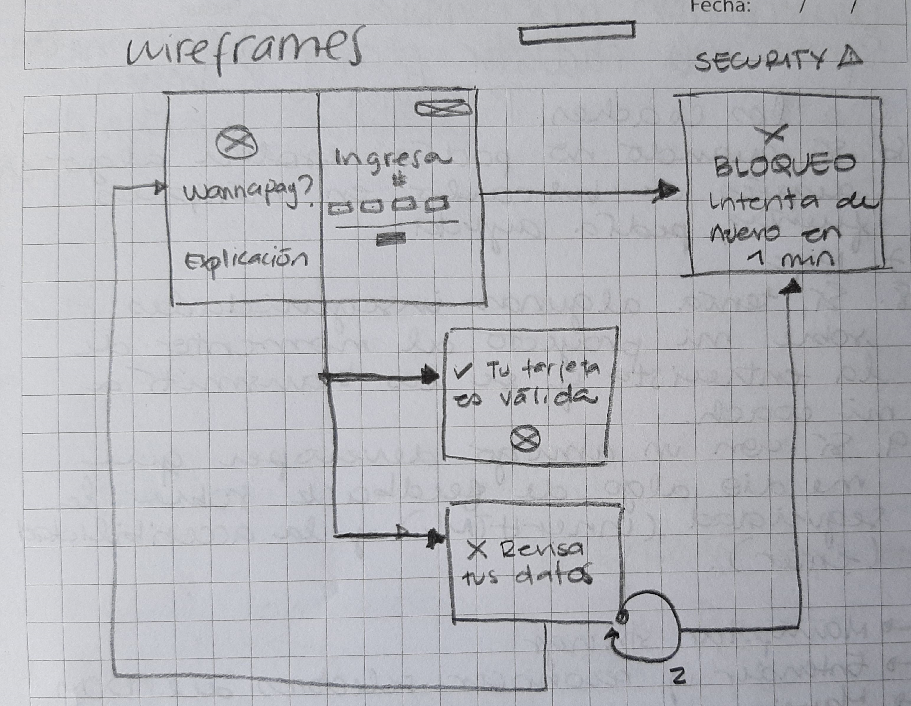

h1 Tarjeta de crédito válida: Wannapay

Wannapay es una aplicación web segura que le permite a un usuario validar el número de su tarjeta de crédito a través de un algoritmo especial para ello (algoritmo de Luhn) sin tener que consultar directamente con la tienda en línea en la que quiere realizar su compra. 

Imágenes finales:
1. Homepage:

2. Página para tarjeta de crédito no valida:

Investigación UX:
Explicar quiénes son los usuarios y los objetivos en relación con el producto.
Definición del producto: 
Quiénes son los principales usuarios de producto.
Cuáles son los objetivos de estos usuarios en relación con tu producto.
Cómo crees que el producto que estás creando está resolviendo sus problemas.
Explicar cómo el producto soluciona los problemas/necesidades de dichos usuarios.

Primer prototipo en papel.

Al consultar con varias compañeras de mesa, les pareció que el sistema era algo complicado -que te llevaba de una pantalla a otra sin darte la información que querías obtener de manera rápida. Por eso se modificó para que el input del usuario se recibiera en la misma página de inicio, y el siguiente paso validaría o no su tarjeta, dándole opciones al usuario de cómo seguir su proceso dependiendo del caso.
También me dijeron por ahí que se parece a una web app de un conocido banco del Perú y que Wannapay suena a quechua. Talk about inclusive UX. :speak_no_evil:

Imagen del prototipo final.
